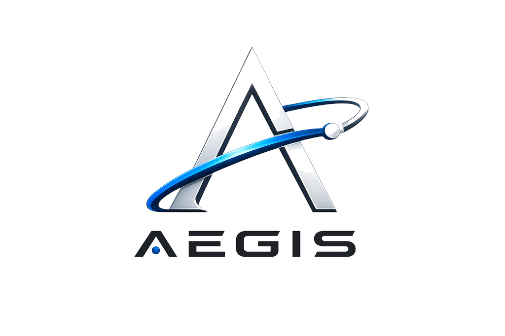
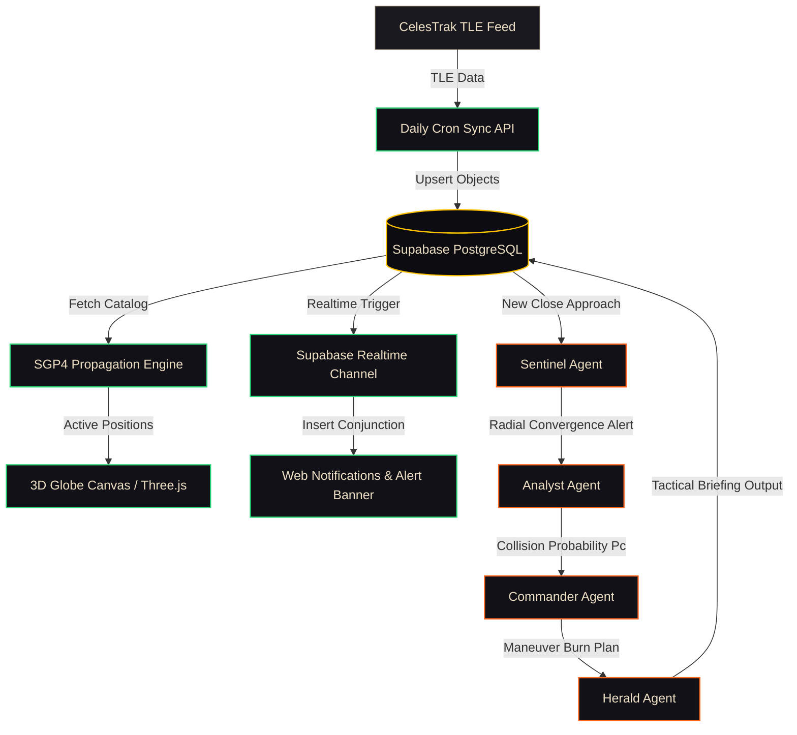

# 🛡️ AEGIS (Autonomous Earth-Orbit Guardian & Intelligence System)

<div align="center">
  
  <p><strong>The first fully autonomous, AI-driven orbital tracking, hazard mitigation, and conjunction management system.</strong></p>
</div>

---

## 🌌 Overview

Space debris and active satellites constitute an increasingly crowded debris field in Earth's orbit. Over **28,000 tracked objects** travel at hypervelocities of up to $7.8\text{ km/s}$, threatening $1\text{ Trillion USD}$ in global satellite infrastructure and crewed missions like the International Space Station (ISS).

**AEGIS** is a state-of-the-art Web interface and AI Agent orchestration pipeline that:
1. **Syncs & Propagates**: Fetches two-line element (TLE) datasets from CelesTrak and propagates them in real-time using high-precision SGP4 orbital mechanics.
2. **Evaluates Close Approaches**: Continuously monitors the entire active catalog to identify close approach events and declares DEFCON risk levels.
3. **Automates Mitigation**: Orchestrates a 4-agent autonomous pipeline powered by Google Gemini to analyze threats, compute collision probabilities, propose evasive burns, and draft notifications.
4. **Visualizes**: Renders an interactive 4K 3D Globe visualization (via Three.js) complete with satellite trails, orbital regimes, and real-time hazard alarms.

---

## 🛠️ System Architecture & Workflow

AEGIS runs on a modern, decoupled serverless architecture using **Next.js**, **Supabase**, and **Google Gemini (Generative AI)**.



---

## 🤖 The Autonomous Multi-Agent Pipeline

When a conjunction event matches monitoring thresholds, the AEGIS autonomous pipeline activates four agents sequentially:

| Agent | Identity Badge | Core Responsibility | Output / Actions |
| :--- | :--- | :--- | :--- |
| **Sentinel** | `SENTINEL` (Green) | Radial Convergence Scanning | Identifies convergence corridors, flags involved NORAD IDs, and alerts downstream agents. |
| **Analyst** | `ANALYST` (Blue) | Probability & Physics Calculations | Computes Hypervelocity Collision Probability ($P_c$) and calculates closest-approach geometry. |
| **Commander** | `COMMANDER` (Gold) | Avoidance Maneuver Planning | Synthesizes orbital mechanics options (retrograde/prograde burns, delta-V, ignition windows). |
| **Herald** | `HERALD` (Purple) | Tactical Briefing & Reporting | Translates complex telemetry and burn plans into clean, operational notifications for satellite operators. |

---

## ⚡ Key Technical Features

### 1. High-Performance Orbital Mechanics
AEGIS implements raw SGP4 propagation (via `satellite.js`) on the client side. To run smoothly even on lower-end laptops:
- **Filtered Rendering**: Slices and filters out low-risk space debris, rendering only active payloads, high-risk items, or target conjunction objects (hard-capped at 2000 nodes).
- **Throttled Calculations**: Restricts SGP4 recalculation of 600+ satellites to once per second while the Time Machine simulator is running (down from every 50ms), reducing CPU overhead by $95\%$.

### 2. Immersive 4K 3D Globe UI
Built using Three.js and custom canvas layers:
- **Atmosphere & Depth**: Adds a glowing atmosphere ring (`#ffc200`) and a warm directional light pointing at the horizon.
- **Dynamic Starfield**: Uses a mathematical particle system (3000 vertices) colored dynamically by temperature (blue, amber, white) instead of a low-res image background.
- **Camera Auto-Focus**: Smoothly pivots the camera to the epicenter of DEFCON 1/2 threats automatically on list changes or conjunction clicks.

### 3. Progressive UX Skeletons & Fallbacks
- **Empty States**: Chat panels display pre-loaded starter prompts and current stats grids. Empty list views show a minimal "ALL CLEAR" state.
- **Pulsed Skeleton Screens**: When API logs or charts are loading, the UI replaces generic spinners with synchronized, pulsing skeleton grid structures matching the active panels.

---

## ⌨️ Keyboard Navigation

Access core modules instantaneously using hotkeys:

| Key | Navigation Path | Action |
| :---: | :--- | :--- |
| `1` | `/threats` | Opens the Close Approach Conjunction Threat Panel |
| `2` | `/simulator` | Launches the Time Machine Orbital Simulator controls |
| `3` | `/analytics` | Displays the Catalog Classification & Debris Growth Charts |
| `4` | `/objects` | Opens the Full Satellites Catalog Drawer |
| `K` | `/chat` | Launches the AEGIS Telemetry co-pilot Chat Assistant |
| `Esc` | *Close Overlay* | Deselects active targets and clears open drawers |

---

## 🚀 Getting Started

### Prerequisites
- Node.js (v18+)
- Supabase Project & URL
- Google Gemini API Key (for Agent reasoning and Chat response)

### Setup Environment
Create a `.env.local` file in the root directory:
```env
NEXT_PUBLIC_SUPABASE_URL=your_supabase_url
NEXT_PUBLIC_SUPABASE_ANON_KEY=your_supabase_anon_key
SUPABASE_SERVICE_ROLE_KEY=your_supabase_service_role_key
GEMINI_API_KEY=your_gemini_key
```

### Database Schema Initialization
Execute the SQL DDL commands in [supabase_schema.sql](file:///c:/Users/rishi/OneDrive/Desktop/AEGIS/aegis-app/supabase_schema.sql) in your Supabase SQL Editor. This will configure the `objects`, `conjunctions`, `agent_logs`, and `chat_messages` tables with appropriate indices, foreign keys, and select-policies.

### Install & Start
```bash
# Install dependencies
npm install

# Run database synchronization (Sync objects from CelesTrak)
# (Optionally triggers via /api/objects/sync route)

# Run development server
npm run dev
```

Open [http://localhost:3000](http://localhost:3000) to access the command deck.

---

🛡️ **AEGIS** — *Autonomous Earth-Orbit Guardian & Intelligence System*. Built with passion for space safety.
